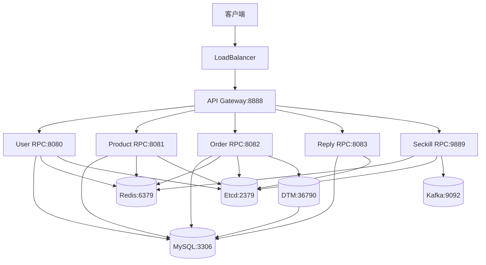

# Go-Zero Shop Kubernetes 部署指南

这是一个基于 Go-Zero 框架构建的微服务电商系统的 Kubernetes 部署方案。

## 🏗️ 系统架构



## 📦 服务组件

### 微服务
- **API Gateway** (8888): HTTP API 网关，统一入口
- **User RPC** (8080): 用户服务
- **Product RPC** (8081): 商品服务  
- **Order RPC** (8082): 订单服务
- **Reply RPC** (8083): 评论服务
- **Seckill RPC** (9889): 秒杀服务

### 分布式事务管理
- **DTM** (36789/36790): 分布式事务管理器，处理全局事务和子事务屏障

### 基础设施
- **MySQL** (3306): 主数据库
- **Redis** (6379): 缓存和会话存储
- **Etcd** (2379): 服务发现和配置中心
- **Kafka** (9092): 消息队列
- **DTM** (36789/36790): 分布式事务管理器

## 🚀 快速开始

### 前置条件

1. **Kubernetes 集群** (1.19+)
2. **kubectl** 客户端工具
3. **Docker** (用于构建镜像)
4. **足够的资源**:
   - CPU: 4 cores+
   - Memory: 8GB+
   - Storage: 50GB+

### 部署步骤

#### 1. 构建 Docker 镜像

```bash
# 构建所有服务镜像
./build-images.sh
```

#### 2. 部署到 Kubernetes

```bash
# 一键部署所有服务
./k8s/deploy.sh
```

#### 3. 验证部署

```bash
# 查看部署状态
./k8s-manage.sh status

# 查看服务日志
./k8s-manage.sh logs
```

### 访问服务

```bash
# 端口转发到本地（开发/测试）
kubectl port-forward service/api-gateway 8888:8888 -n go-zero-shop

# 访问 API 网关
curl http://localhost:8888/ping
```

## 🔧 管理命令

### 服务管理

```bash
# 查看服务状态
./k8s-manage.sh status

# 查看服务日志
./k8s-manage.sh logs

# 重启所有服务
./k8s-manage.sh restart

# 扩缩容服务
./k8s-manage.sh scale

# 测试连通性
./k8s-manage.sh test

# 清理资源
./k8s-manage.sh clean
```

### 常用 kubectl 命令

```bash
# 查看所有资源
kubectl get all -n go-zero-shop

# 查看 Pod 详情
kubectl describe pod <pod-name> -n go-zero-shop

# 查看 Pod 日志
kubectl logs -f <pod-name> -n go-zero-shop

# 进入 Pod 调试
kubectl exec -it <pod-name> -n go-zero-shop -- sh

# 删除特定服务
kubectl delete deployment <service-name> -n go-zero-shop
```

## 🧪 API 测试

### 基础接口测试

```bash
# Health Check
curl http://localhost:8888/ping

# 获取商品列表
curl -X GET "http://localhost:8888/product/list?current=1&pageSize=10"

# 获取商品分类
curl -X GET "http://localhost:8888/category/list"

# 获取商品详情
curl -X GET "http://localhost:8888/product/detail?id=1"
```

### 用户相关接口

```bash
# 用户注册
curl -X POST "http://localhost:8888/user/register" \
     -H "Content-Type: application/json" \
     -d '{"username":"testuser","password":"123456","mobile":"13800138000"}'

# 用户登录
curl -X POST "http://localhost:8888/user/login" \
     -H "Content-Type: application/json" \
     -d '{"username":"testuser","password":"123456"}'
```

## 📊 监控和观测

### 查看资源使用情况

```bash
# Pod 资源使用
kubectl top pods -n go-zero-shop

# Node 资源使用
kubectl top nodes
```

### 事件和日志

```bash
# 查看命名空间事件
kubectl get events -n go-zero-shop --sort-by=.metadata.creationTimestamp

# 查看特定服务日志
kubectl logs -f deployment/api-gateway -n go-zero-shop
```

## 🔨 故障排查

### 常见问题

1. **Pod 启动失败**
   ```bash
   kubectl describe pod <pod-name> -n go-zero-shop
   kubectl logs <pod-name> -n go-zero-shop
   ```

2. **服务无法访问**
   ```bash
   kubectl get services -n go-zero-shop
   kubectl describe service <service-name> -n go-zero-shop
   ```

3. **数据库连接问题**
   ```bash
   kubectl exec -it deployment/mysql -n go-zero-shop -- mysql -u root -p
   ```

4. **服务发现问题**
   ```bash
   kubectl exec -it deployment/etcd -n go-zero-shop -- etcdctl endpoint health
   ```

### 调试技巧

```bash
# 进入任意 Pod 进行网络调试
kubectl run debug --image=nicolaka/netshoot --rm -it --restart=Never -n go-zero-shop

# 检查 DNS 解析
nslookup mysql.go-zero-shop.svc.cluster.local

# 检查端口连通性
telnet mysql 3306
```

## 🔐 生产环境配置

### 安全配置

1. **更新默认密码**
   - MySQL root 密码
   - JWT 密钥
   - Redis 密码（如需要）

2. **配置 TLS**
   - API Gateway HTTPS
   - 数据库连接加密
   - 服务间通信加密

3. **网络策略**
   ```yaml
   apiVersion: networking.k8s.io/v1
   kind: NetworkPolicy
   metadata:
     name: go-zero-shop-network-policy
     namespace: go-zero-shop
   # ... 网络策略配置
   ```

### 持久化存储

```yaml
# 生产环境建议使用 SSD 存储类
apiVersion: v1
kind: PersistentVolumeClaim
metadata:
  name: mysql-pvc-prod
spec:
  storageClassName: fast-ssd
  accessModes:
    - ReadWriteOnce
  resources:
    requests:
      storage: 100Gi
```

### 资源限制

```yaml
resources:
  requests:
    memory: "256Mi"
    cpu: "200m"
  limits:
    memory: "512Mi"
    cpu: "500m"
```

## 📝 配置说明

### 环境变量配置

| 服务 | 配置文件 | 主要配置项 |
|------|----------|------------|
| User RPC | `k8s/configs/user-rpc-config.yaml` | 数据库连接、Redis配置 |
| Product RPC | `k8s/configs/product-rpc-config.yaml` | 数据库连接、Redis配置、Jaeger链路追踪 |
| Order RPC | `k8s/configs/order-rpc-config.yaml` | 数据库连接、依赖RPC服务 |
| API Gateway | `k8s/configs/api-gateway-config.yaml` | JWT配置、RPC服务地址 |

### 数据库配置

数据库初始化脚本位于 `k8s/configs/mysql-init.yaml`，包含：
- 数据库创建
- 表结构定义  
- 初始数据插入

## 🤝 贡献指南

1. Fork 项目
2. 创建功能分支
3. 提交更改
4. 发起 Pull Request

## 📄 许可证

本项目采用 MIT 许可证，详情请查看 LICENSE 文件。

## 🆘 支持

如遇问题，请通过以下方式寻求帮助：
- 提交 GitHub Issue
- 查看项目文档
- 联系维护团队